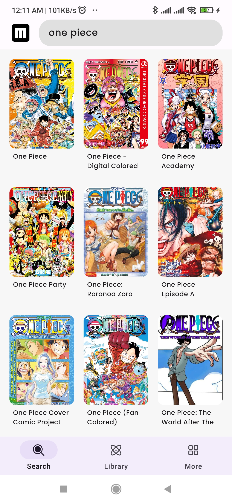
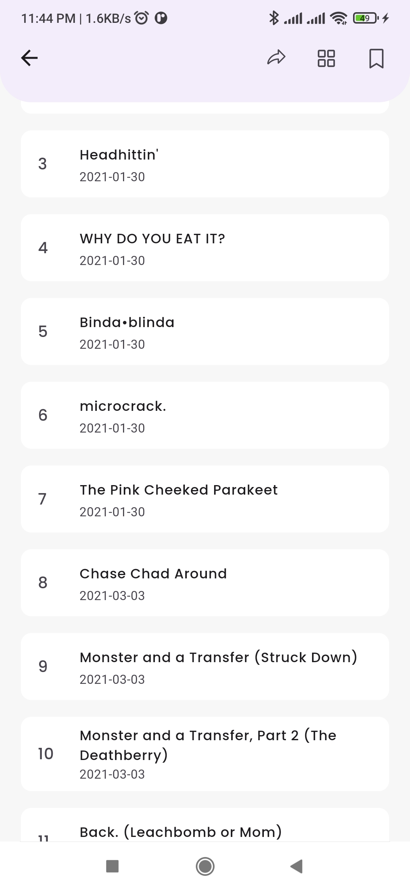
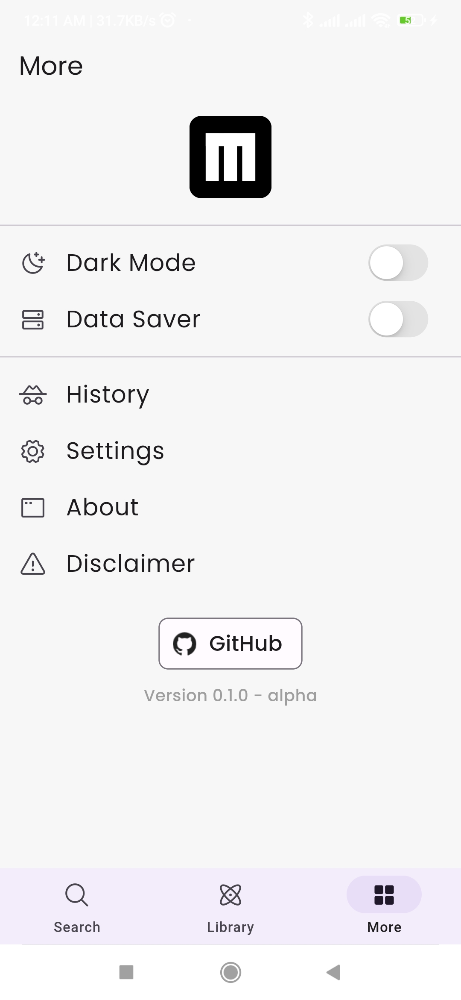

<br>

# Moriko

> The app is still in the development phase.

## Overview

Moriko is a Manga reader powered by MangaDex built with Flutter that allows users to read manga seamlessly on their devices.

&nbsp;&nbsp;&nbsp;
&nbsp;&nbsp;&nbsp;

&nbsp;&nbsp;&nbsp;
&nbsp;&nbsp;&nbsp;


## Features

- **Browse Manga**: Explore a vast collection of manga titles with a user-friendly interface.
- **Read Manga**: Read manga chapters with a smooth and interactive reading experience.
- **Bookmark Favorite Manga**: Save your favorite manga titles for quick access.
- **Search Functionality**: Easily find manga titles using the search feature.
- **Zoom and Pan**: Enjoy manga pages with zoom and pan functionalities for a better reading experience.

## Getting Started

### Prerequisites

- [Flutter](https://flutter.dev/docs/get-started/install)

### Installation

```bash
git clone https://github.com/subrotokumar/moriko.git
cd moriko
flutter run release
```

## Disclaimer

The developer of this application does not have any affiliation with the content providers available. Moriko is a app for users to access and read manga titles, and the developer is not responsible for the content provided by external sources.
